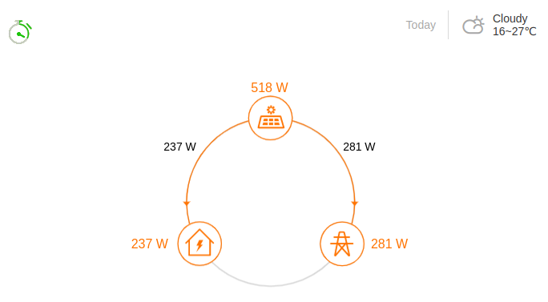
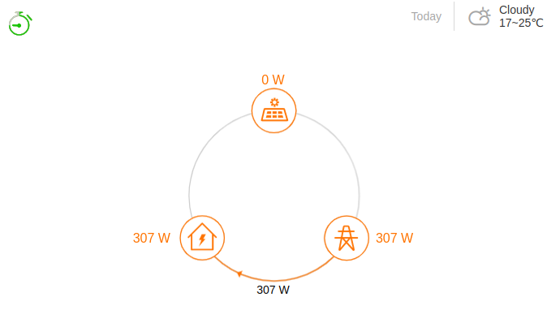
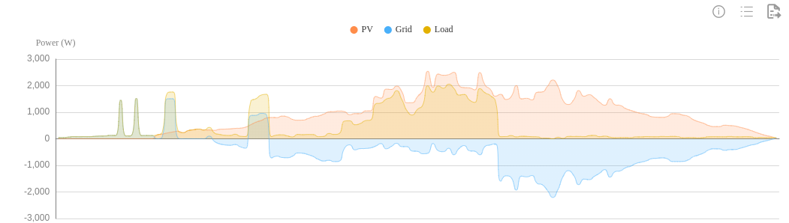
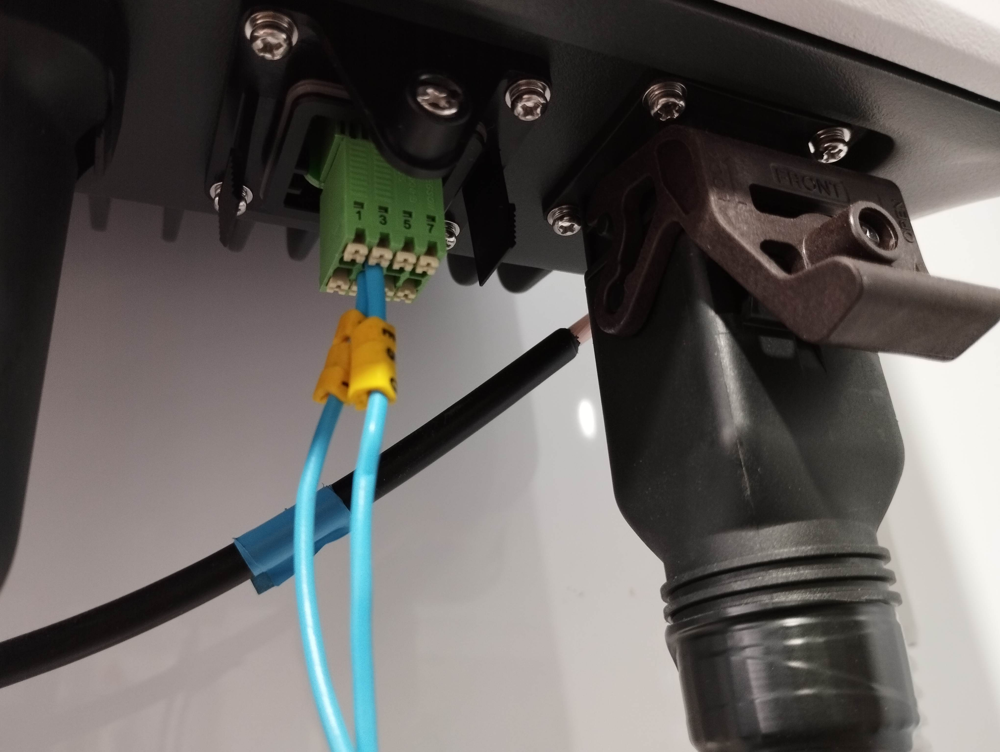
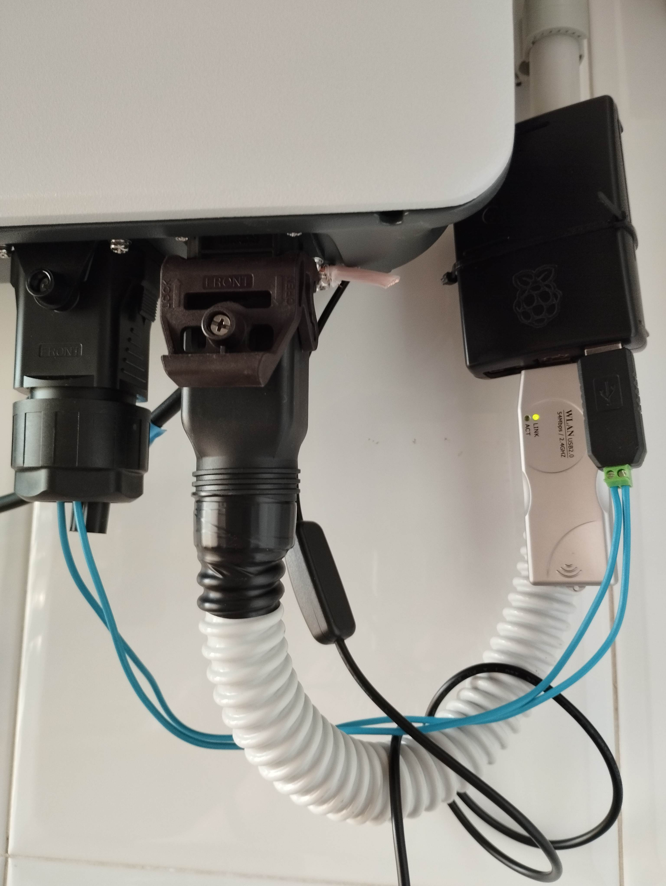

<a href="https://www.buymeacoffee.com/rbpiuserf" target="_blank"></a>
<br>
<br>
Last update: 2023/12/10<br>
The project is working again, thanks to @pdf83 support.
Sungrow has changed some behavior in the firmare and the main script has been updated. 
<br>
<br>
2023/12/10<br>
After updating my SG5.0RS to the firmware version SUNSTONE-S_B000.V001.P029-20231019.zip the inverter is lo longer requesting the address 356+8 registers (164H, Active power of phase A,B,C and Total active power). In addition, the meter is not detected on the web yet.<br>
But we have a new player: fe03500000018105. Register 5000H? What is that?<br>
The script cheater.sh has been updated to answer 0, but no request for active power is received yet.<br>
Do you know the solution? Please let me know on "issues". Thanks in advance.<br>
<br>
# Sungrow-Meter-cheater
Sungrow DTSU666 power meter emulation using a Raspberry Pi

#### Project objectives
This is a research project that aims to emulate a Sungrow Meter DTSU666

#### Main references
cheater.sh<br>
https://github.com/meltaxa/solariot/issues/27<br>
https://stackoverflow.com/questions/2746553/read-values-into-a-shell-variable-from-a-pipe<br>
https://www.exploringbinary.com/twos-complement-converter/<br>

calc_crc16.sh<br>
https://ctlsys.com/support/how_to_compute_the_modbus_rtu_message_crc/<br>
https://github.com/onslauth/bash_crc16<br>
https://stackoverflow.com/questions/8564267/crc16-algorithm-from-c-to-bash<br>
https://crccalc.com/<br>

#### Requeriments
1. A Sungrow inverter, I'm using a SG5.0RS
2. A Raspberry Pi, I'm using a Raspberry Pi 2 and a 2 GB SD card
3. Raspberry Pi OS Lite, I'm using 32-bit: https://www.raspberrypi.com/software/operating-systems/#raspberry-pi-os-32-bit
4. A 485 dongle, I'm using a ARCELI USB to 485 adapter: https://amzn.eu/d/59K0N9B
5. Install the required software: sudo apt install screen stty curl jq

#### Installation
Connect two wires from COM2 terminals (A2,B2) to 485 adapter terminals (D+,D-). Read the documentation of you inverter, I have used the page 20 of this manual:  https://aus.sungrowpower.com/upload/file/20210707/SG2.0-6.0RS-UEN-Ver11-202106.pdf

#### Configuring /home/pi
1. Copy these files to /home/pi/cheater
```
cheater.sh
Shelly_get_em0.sh
calc_crc16.sh
```

#### Configuring crontab for 'pi' user
1. Run "crontab -e" and add:
```
@reboot (cd /home/pi/cheater; screen -d -m ./cheater.sh)
```

2. Not mandatory but recommended: run "sudo crontab -e" and add:
```
0 4   *       *       *       /sbin/reboot
```

3. Reboot and run "screen -r" to check if the communication is working:
```
request: fe03003f0001a009: slave 254 ($FE), register 63 ($3F), 1 register | answer: address=254 ($FE), baud rate=1 (9600 bps) FE0302FE012DF0
request: fe03500000018105: slave 254 ($FE), register 20480 ($5000), 1 register | answer: device type coding=0x20D5 FE030220D5740F
request: fe03016400081020: slave 254 ($FE),register 356 ($0164), 8 registers, Active power of phases A,B,C and Total active power | answer: (A,Total=-615 W, B,C=0 W) FE0310FFFFFD990000000000000000FFFFFD99DED2
request: fe0300770001201f: slave 254 ($FE), register 119 ($77), 1 register, Frequency | answer: 50 Hz, FE030200322D85
request: fe03000a000c71c2, register 10 ($0A), 12 registers, Current forward active total/spike/peak/flat/valley/... electric energy | answer: (0,0,0,0,0,0) FE03180000000000000000000000000000000000000000000000006F1F
request: fe03003f0001a009: slave 254 ($FE), register 63 ($3F), 1 register | answer: address=254 ($FE), baud rate=1 (9600 bps) FE0302FE012DF0
request: 207300000001c370: slave $20, register 0 ($00), 1 register | answer: 207300000001c370
request: 20030000000d82be: slave 32 ($20), register 0 ($00), 13 registers | answer: 20031A0000000100000001000000010000000100000001000000010006767
request: 20030000000d82be: slave 32 ($20), register 0 ($00), 13 registers | answer: 20031A0000000100000001000000010000000100000001000000010006767
request: 20030000000d82be: slave 32 ($20), register 0 ($00), 13 registers | answer: 20031A0000000100000001000000010000000100000001000000010006767
...
```

4. Exit from screen command using the sequence (Control+a)+d

#### Images
Injection:<br>


Consumption:<br>


Trend:<br>


485 Connection:<br>


RBPi2:<br>


